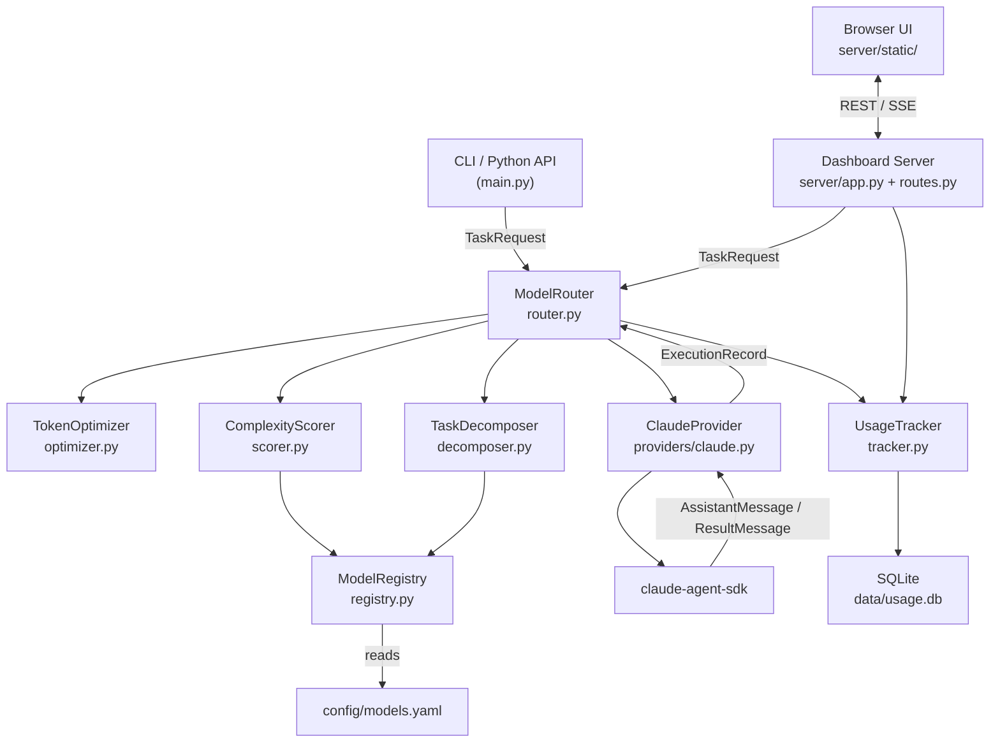
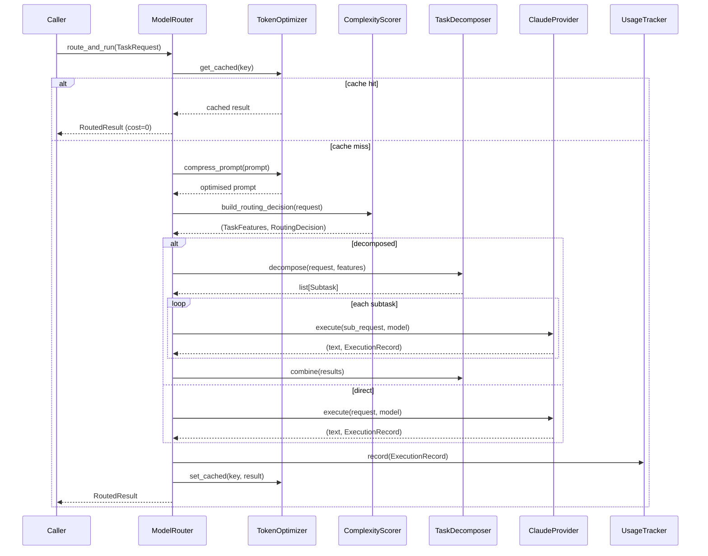

# Architecture

## System Overview

Model Router is a thin orchestration layer that sits between your application code (or CLI) and the Claude API. It intercepts every task request, evaluates its complexity, selects the most appropriate — and cost-efficient — model, optionally splits large tasks into parallel subtasks, executes them through a provider adapter, and stores every call in a local SQLite database.

## Component Descriptions

### `ModelRouter` — the central orchestrator

`ModelRouter` (in `model_router/router.py`) owns the complete request pipeline. It wires all sub-components together and exposes two public coroutines:

- `route_task(request)` — analyse and return a `RoutingDecision` without executing
- `route_and_run(request)` — full pipeline: compress → score → decompose? → execute → track → return

### `ComplexityScorer` — model selector

`ComplexityScorer` (`scorer.py`) converts a raw `TaskRequest` into a numeric complexity score (0.0–1.0) using five weighted signals:

| Signal | Weight | Notes |
|---|---|---|
| Estimated token count | 35% | Normalised to 8 000 tokens |
| Keyword complexity | 30% | Regex patterns weighted +/− |
| Quality requirement | 20% | Caller-supplied 0–1 value |
| Architecture signals | 10% | Detects design-related language |
| Multi-file references | 5% | Two or more file paths in prompt |

The score is compared to two configurable thresholds to select between Opus, Sonnet, and Haiku.

### `TaskDecomposer` — large-task splitter

When the estimated token count exceeds `decompose_threshold × context_window`, `TaskDecomposer` (`decomposer.py`) breaks the request into typed subtasks:

| Task type | Decomposition strategy |
|---|---|
| `coding` | One subtask per referenced file; Sonnet per file, Opus for integration |
| `review` | Four parallel concern passes (security, performance, correctness, style); Opus synthesises |
| `docs` | Three sections (overview, API reference, examples); Opus assembles final document |
| `reasoning` | Two halves analysed by Sonnet; Opus synthesises |
| `chat` / fallback | Generic chunk-based split |

### `TokenOptimizer` — cost reducer

`TokenOptimizer` (`optimizer.py`) operates on two axes:

1. **Prompt compression** — three-pass lossy-last strategy applied when estimated tokens exceed `compress_threshold`:
   - Pass 1: whitespace normalisation (lossless)
   - Pass 2: strip numbered examples beyond the 5th (near-lossless)
   - Pass 3: middle-truncation, preserving the first and last 35% (lossy)

2. **Result caching** — SHA-256 keyed in-memory cache (prompt + task type) with configurable TTL. Prevents redundant API calls for identical prompts.

### `ModelRegistry` — config loader

`ModelRegistry` (`registry.py`) parses `config/models.yaml` and provides typed access to model capabilities, routing config, and token estimation parameters. Supports hot-reload via `reload()`.

### `ClaudeProvider` — SDK adapter

`ClaudeProvider` (`providers/claude.py`) is the only built-in provider. It wraps `claude-agent-sdk`'s async `query()` function, accumulates token usage from streaming messages, and returns a populated `ExecutionRecord`.

### `UsageTracker` — persistent telemetry

`UsageTracker` (`tracker.py`) writes every `ExecutionRecord` to SQLite using `asyncio.to_thread` so disk I/O never blocks the event loop. It exposes async query methods used by the dashboard API.

### Dashboard server

`server/app.py` creates a Starlette application that mounts:
- REST + SSE JSON API (defined in `server/routes.py`)
- Static files — the single-page dashboard (`server/static/`)

## Data Flow

## Key Technical Decisions

### Why SQLite?

All deployments are single-process; SQLite avoids an external dependency while still providing full SQL query capability for the dashboard. The schema includes three indexes (timestamp, model, session_id) to keep dashboard queries fast.

### Why SSE for the dashboard?

Server-Sent Events provide one-way push from the server to the browser without WebSocket complexity. The `/api/stats/live` endpoint emits updated totals every 2 seconds, giving a near-real-time feel with minimal overhead.

### Provider abstraction

`BaseProvider` (two abstract methods: `execute` and `supports_model`) makes adding a new AI provider a single-file change. No modifications to `ModelRouter` are needed — just register the new instance in `__init__`.

### Fallback chain

The scorer assigns a one-tier-down fallback for every selection (Opus → Sonnet → Haiku). The `ClaudeProvider` receives `fallback_model_string` and can retry on transient errors without re-scoring.
